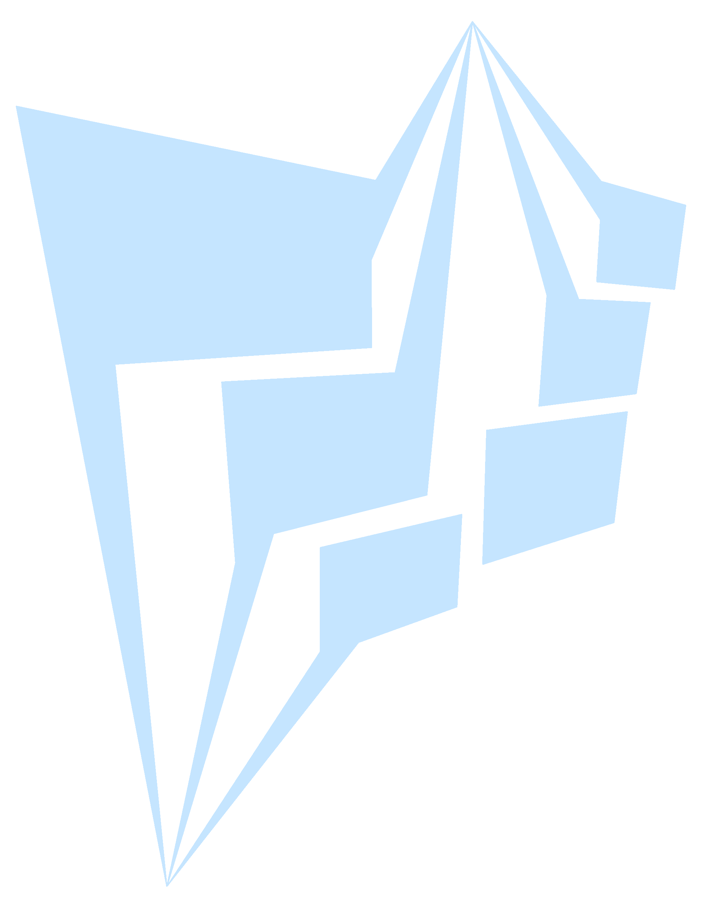

<!-- PROJECT SHIELDS -->
<!--
*** I'm using markdown "reference style" links for readability.
*** Reference links are enclosed in brackets [ ] instead of parentheses ( ).
*** See the bottom of this document for the declaration of the reference variables
*** for contributors-url, forks-url, etc. This is an optional, concise syntax you may use.
*** https://www.markdownguide.org/basic-syntax/#reference-style-links
-->
[![Contributors][contributors-shield]][contributors-url]
[![Forks][forks-shield]][forks-url]
[![Stargazers][stars-shield]][stars-url]
[![Issues][issues-shield]][issues-url]
[![MIT License][license-shield]][license-url]


<!-- PROJECT LOGO -->
<br />
<div align="center">
  <a href="https://github.com/Mikuel210/Statify">
    
  </a>

<h3 align="center">Statify</h3>

  <p align="center">
    A modern, highly customizable static site generator for Python
    <br />
    <a href="https://github.com/Mikuel210/Statify/issues/new?labels=bug&template=bug-report---.md">Report Bug</a>
    ·
    <a href="https://github.com/Mikuel210/Statify/issues/new?labels=enhancement&template=feature-request---.md">Request Feature</a>
  </p>
</div>


<!-- TABLE OF CONTENTS -->
<details>
  <summary>Table of Contents</summary>
  <ol>
    <li>
      <a href="#about-the-project">About The Project</a>
      <ul>
        <li><a href="#built-with">Built With</a></li>
      </ul>
    </li>
    <li>
      <a href="#getting-started">Getting Started</a>
      <ul>
        <li><a href="#prerequisites">Prerequisites</a></li>
        <li><a href="#installation">Installation</a></li>
      </ul>
    </li>
    <li><a href="#usage">Usage</a></li>
    <li><a href="#roadmap">Roadmap</a></li>
    <li><a href="#contributing">Contributing</a></li>
    <li><a href="#license">License</a></li>
  </ol>
</details>


<!-- ABOUT THE PROJECT -->

## About The Project

Statify is a highly customizable static site generator for Python. Statify allows you to make anything into a web.
You decide where you get your data from and how is it compiled into the final page.

[![Python][Python.org]][Python-url]

<p align="right">(<a href="#readme-top">back to top</a>)</p>


<!-- GETTING STARTED -->

## Getting Started

### Prerequisites

- [Python](https://www.python.org/downloads/)

### Installation

1. Clone the repository
   ```sh
   git clone https://github.com/Mikuel210/Statify.git
   ```
2. Install the requirements
    ```sh
    cd Statify # CD to the installation folder
    pip install -r requirements.txt
   ```
3. Add the ``bin`` folder to your ``PATH``

<p align="right">(<a href="#readme-top">back to top</a>)</p>


<!-- USAGE EXAMPLES -->

## Usage

To create a new Statify project, create a new directory and type in the terminal:

```sh
statify init
```

You can also choose a template to start from. You can list all of the available templates by using
``statify templates``.
You can create your own templates by placing them into the ``bin/init`` directory in the Statify installation.

Type ``statify init [template]`` to start a new project from a template.

### The compile file

The compile file is executed when you run ``statify compile``. Its purpose is to get the required data and turn it
into the final pages.

This is how a basic compile file might look:

```python
from pathlib import Path

pages = Path("pages")

for page in pages.iterdir():
    statify.compile({
        "input_path": page,
        "output_path": f"public/{page.name}"
    })
```

This compile file takes all templates from a directory and calls ``statify.compile`` to turn them into the final
pages. The compile file is executed in a "virtual environment," which are executed in the project's temporary
directory. The ``statify`` module is automatically imported for all virtual environments, and you are able to import
other modules like ``constants`` or ``compiler``.

``statify.compile`` takes a context dictionary. A context might include:

- ``input_path``: The path of the template
- ``output_path``: The path of the final page
- ``venv_template``: The Python code to be executed before the code in the template. Both are executed in the same
  virtual environment, so the code in the page template is able to access the code in the virtual environment template.

The context can also include other custom keys, which are accessible through the ``statify.context`` variable.
It is recommended to use ``statify.get_context_value``, ``statify.get_context_value_safe`` and
``statify.set_context_value`` instead of directly working with the variable.

### The templates

Templates are HTML files that can have embedded Python code. Embedded Python code is written inside of a ``<python>``
tag.

Templates get converted into virtual environments when they are compiled. All HTML code is turned into a
``statify.write`` call in the virtual environment, and embedded Python code remains the same. Embedded Python code
is written into the virtual environment with its indentation relative to the ``<python>`` tag. HTML code is
turned into a ``statify.write`` call with no indentation.

Useful functions for using in templates:

- ``statify.write``: Writes content to the final page
- ``statify.render_partial``: Compiles a template and writes it to the current page instead of to
  a file

### Project configuration

Statify projects can have a ``.statifyconfig`` file either in the root directory or in a ``config`` directory.
This file can overwrite default configuration values for this project only:

- ``compile_file``: The path to the compile file to be executed with ``statify compile``
- ``temp_directory``: The directory to execute virtual environments in. All of its contents are deleted
  on compile.
- ``public_directory``: The directory for compiled pages. All of its contents are deleted
  on compile.
- ``resources_directory``: The directory, relative to the public directory, that will be kept on compile. Useful
  for storing CSS or JavaScript files that final pages might need to access.
- ``debug``: If set to true, virtual environments won't be deleted until compiling again.

<p align="right">(<a href="#readme-top">back to top</a>)</p>


<!-- ROADMAP -->

## Roadmap

- [ ] More templates
- [ ] Installation wizard
- [ ] More default functions
- [ ] Better IDE integration

See the [open issues](https://github.com/Mikuel210/Statify/issues) for a full list of proposed features and
known issues.

<p align="right">(<a href="#readme-top">back to top</a>)</p>


<!-- CONTRIBUTING -->

## Contributing

Contributions are what make the open source community such an amazing place to learn, inspire, and create. Any
contributions you make are **greatly appreciated**.

If you have a suggestion that would make this better, please fork the repository and create a pull request. You can
also simply open an issue with the tag "enhancement."
Don't forget to give the project a star! Thanks again!

1. Fork the Project
2. Create your Feature Branch (`git checkout -b feature/AmazingFeature`)
3. Commit your Changes (`git commit -m 'Add some AmazingFeature'`)
4. Push to the Branch (`git push origin feature/AmazingFeature`)
5. Open a Pull Request

<p align="right">(<a href="#readme-top">back to top</a>)</p>

### Top contributors:

<a href="https://github.com/Mikuel210/Statify/graphs/contributors">
  
</a>


<!-- LICENSE -->

## License

Distributed under the MIT License. See `LICENSE.txt` for more information.

<p align="right">(<a href="#readme-top">back to top</a>)</p>


<!-- MARKDOWN LINKS & IMAGES -->
<!-- https://www.markdownguide.org/basic-syntax/#reference-style-links -->

[contributors-shield]: https://img.shields.io/github/contributors/Mikuel210/Statify.svg?style=for-the-badge

[contributors-url]: https://github.com/Mikuel210/Statify/graphs/contributors

[forks-shield]: https://img.shields.io/github/forks/Mikuel210/Statify.svg?style=for-the-badge

[forks-url]: https://github.com/Mikuel210/Statify/network/members

[stars-shield]: https://img.shields.io/github/stars/Mikuel210/Statify.svg?style=for-the-badge

[stars-url]: https://github.com/Mikuel210/Statify/stargazers

[issues-shield]: https://img.shields.io/github/issues/Mikuel210/Statify.svg?style=for-the-badge

[issues-url]: https://github.com/Mikuel210/Statify/issues

[license-shield]: https://img.shields.io/github/license/Mikuel210/Statify.svg?style=for-the-badge

[license-url]: https://github.com/Mikuel210/Statify/blob/master/LICENSE.txt

[linkedin-shield]: https://img.shields.io/badge/-LinkedIn-black.svg?style=for-the-badge&logo=linkedin&colorB=555

[linkedin-url]: https://linkedin.com/in/linkedin_username

[product-screenshot]: images/screenshot.png

[Next.js]: https://img.shields.io/badge/next.js-000000?style=for-the-badge&logo=nextdotjs&logoColor=white

[Next-url]: https://nextjs.org/

[React.js]: https://img.shields.io/badge/React-20232A?style=for-the-badge&logo=react&logoColor=61DAFB

[React-url]: https://reactjs.org/

[Vue.js]: https://img.shields.io/badge/Vue.js-35495E?style=for-the-badge&logo=vuedotjs&logoColor=4FC08D

[Vue-url]: https://vuejs.org/

[Angular.io]: https://img.shields.io/badge/Angular-DD0031?style=for-the-badge&logo=angular&logoColor=white

[Angular-url]: https://angular.io/

[Svelte.dev]: https://img.shields.io/badge/Svelte-4A4A55?style=for-the-badge&logo=svelte&logoColor=FF3E00

[Svelte-url]: https://svelte.dev/

[Laravel.com]: https://img.shields.io/badge/Laravel-FF2D20?style=for-the-badge&logo=laravel&logoColor=white

[Laravel-url]: https://laravel.com

[Bootstrap.com]: https://img.shields.io/badge/Bootstrap-563D7C?style=for-the-badge&logo=bootstrap&logoColor=white

[Bootstrap-url]: https://getbootstrap.com

[JQuery.com]: https://img.shields.io/badge/jQuery-0769AD?style=for-the-badge&logo=jquery&logoColor=white

[JQuery-url]: https://jquery.com

[Python.org]: https://www.python.org/static/community_logos/python-powered-w-200x80.png

[Python-url]: https://www.python.org/
